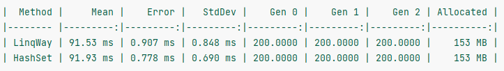

# Тестовое задание UABContourLab

Решение тестового задания для [вакансии](https://hh.ru/vacancy/51473069).

## Первое задание

**Папка:** `./"1_задание"`

### ТЗ:

Есть массив целых чисел. Числа могут повторяться. Выбрать все числа массива не имеющие пары.

### Решение:

```c#
public int[] RemoveDuplicates(int[] input)
{
    return input.Distinct().ToArray();
}
```

Также в папке есть проект UABContourLab, в котором произведен простой benchmark двух решений: через linq и через создание `HasSet`.



Результаты показывают, что с точки зрения производительности разницы нет.

## Второе задание

**Папка:** `./"2_задание"`

### ТЗ:

Выбрать работников, зарабатывающих больше своего начальника. [Схема](https://drive.google.com/file/d/1ctecqG34HoD_gi7fZQMPhB4zLrTu3Gkq/view?usp=sharing).

### Решение:
Использован диалект SQL Server'a. Он упоминался у вас на сайте.
```sql
SELECT E.NAME AS 'Имя работника', E.SALARY AS 'Зарплата работника', C.SALARY AS 'Зарплата начальника'
FROM EMPLOYEE E
    LEFT JOIN EMPLOYEE C ON E.CHIEF_ID = C.ID
WHERE E.SALARY > C.SALARY;
```

Также дополнительно приложил скрипт для создания таблиц с тестовыми данными. Находится в файле `tables.sql`.

## Зарплата

**Сейчас** _(20 часов в неделю, удаленка)_: 40k

**Через год** _(40 часов в неделю, возможно офис)_: 100k